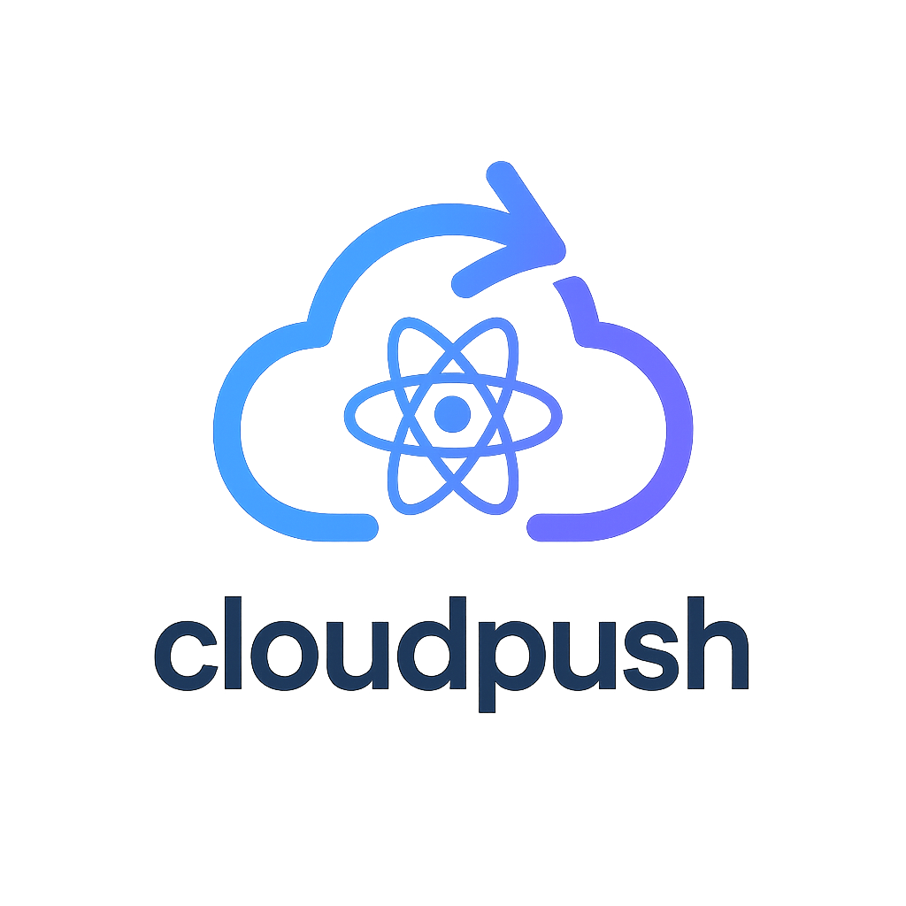

<p align="center">
  
</p>

[](https://www.npmjs.com/package/@cloud-push/cloud)  
[](https://www.npmjs.com/package/@cloud-push/react-native)  
[](https://www.npmjs.com/package/@cloud-push/next)  
[](https://www.npmjs.com/package/@cloud-push/core)  

**OTA Update solution compatible with Expo Updates**  
→ Self-hosted update distribution system

## 🚀 Motivation

Expo projects are highly customized React Native projects. Because of this, available CodePush solutions are limited.  
This project, inspired by [`hot-updater`](https://github.com/gronxb/hot-updater), offers an alternative way to manage bundles using storage services like S3, Firebase, Supabase, etc.  
It follows [Expo Updates technical specs](https://docs.expo.dev/technical-specs/expo-updates-1/) and maintains compatibility with Expo Updates.


## 🧪 Compatibility

- ✅ Works with `expo run:android --variant release`
- ✅ Works with `expo run:ios --configuration Release`
- ✅ Compatible with **Expo Managed Workflow**
## ✨ Key Features

- 📡 Self-hosted deployment supported
- 📦 Flexible storage & DB (S3, Supabase, Firebase, etc.)
- 🔄 Compatible with Expo Updates APIs
- 💾 Web-based bundle version dashboard
- 🌐 Supports expo.dev environment variables (via EAS Secrets)
- 🪟 Works on Windows
- 🧪 EAS build supported


## ⚙️ Quick Start

Start using `cloud-push` in two parts: the **server** and the **expo client**.

---

### 📡 Server Setup

1. Use the template: [cloud-push-nexus](https://github.com/doyoonkim12345/cloud-push-nexus)
2. Deploy it to [Vercel](https://vercel.com)

---

### 📱 Expo Client Setup

#### 1️⃣ Install the package

```bash
pnpm add @cloud-push/react-native @cloud-push/cloud
```

#### 2️⃣ Initialize config

```bash
pnpm cloud-push init
```

#### 3️⃣ Modify your `app.json` or `app.config.ts`

```diff
  updates: {
-    url: "https://u.expo.dev/"
+    url: "https://your-server-domain/api/manifest",
+    requestHeaders: {
+      "expo-channel-name": process.env.APP_VARIANT,
+    },
  },
```

#### 4️⃣ Provide environment variables

Set variables in `.env` or use **EAS Secrets**:

```env
SUPABASE_URL=...
SUPABASE_KEY=...
SUPABASE_BUCKET_NAME=...
```

> ✅ Provide appropriate values for AWS, Supabase, or Firebase depending on your storage backend.

#### 5️⃣ Deploy the update

```bash
pnpm cloud-push deploy
```

> 💡 OTA updates will only apply to builds with the same `runtimeVersion`


## ⚠️ Android Cleartext Warning

Allow HTTP requests by setting `usesCleartextTraffic`:

```ts
export default {
  expo: {
    name: "your-app-name",
    slug: "your-app-slug",
    plugins: [
      [
        "expo-build-properties",
        {
          android: {
            usesCleartextTraffic: true,
          },
          ios: {},
        },
      ],
    ],
  },
};
```

## ⚙️ cloud-push.config type

```ts
type Config = {
  runtimeVersion?: string;
  storage: StorageClient;
  db: DbClient;
};
```

## 🛠 Configuration Examples

### Supabase

```ts
import { defineConfig } from "@cloud-push/react-native";
import { SupabaseStorageClient, SupabaseDbClient } from "@cloud-push/cloud";
import version from "./version";

const storageClient = new SupabaseStorageClient({
  bucketName: process.env.SUPABASE_BUCKET_NAME!,
  supabaseUrl: process.env.SUPABASE_URL!,
  supabaseKey: process.env.SUPABASE_KEY!,
});

const dbClient = new SupabaseDbClient({
  tableName: process.env.SUPABASE_TABLE_NAME!,
  supabaseUrl: process.env.SUPABASE_URL!,
  supabaseKey: process.env.SUPABASE_KEY!,
});

export default defineConfig(() => ({
  runtimeVersion: version.runtimeVersion,
  storage: storageClient,
  db: dbClient,
}));
```

### AWS S3 + lowdb

```ts
import { defineConfig } from "@cloud-push/react-native";
import { AWSS3StorageClient, LowDbClient } from "@cloud-push/cloud";
import version from "./version";

const storageClient = new AWSS3StorageClient({
  accessKeyId: process.env.AWS_ACCESS_KEY_ID!,
  bucketName: process.env.AWS_BUCKET_NAME!,
  region: process.env.AWS_REGION!,
  secretAccessKey: process.env.AWS_SECRET_ACCESS_KEY!,
});

const dbClient = new LowDbClient({
  downloadJSONFile: () => storageClient.getFile({ key: "cursor.json" }),
  uploadJSONFile: (file: Uint8Array) =>
    storageClient.uploadFile({ key: "cursor.json", file }),
});

export default defineConfig(() => ({
  runtimeVersion: version.runtimeVersion,
  storage: storageClient,
  db: dbClient,
}));
```

### Firebase

```ts
import { defineConfig } from "@cloud-push/react-native";
import { FirebaseStorageClient, FirebaseDbClient } from "@cloud-push/cloud";
import version from "./version";

const storageClient = new FirebaseStorageClient({
  credential: process.env.FIREBASE_CREDENTIAL!,
  bucketName: process.env.FIREBASE_BUCKET_NAME!,
});

const dbClient = new FirebaseDbClient({
  credential: process.env.FIREBASE_CREDENTIAL!,
  databaseId: process.env.FIREBASE_DATABASE_ID!,
});

export default defineConfig(() => ({
  runtimeVersion: version.runtimeVersion,
  storage: storageClient,
  db: dbClient,
}));
```

### Custom

```ts
import { defineConfig } from "@cloud-push/react-native";
import { StorageClient, DbClient } from "@cloud-push/cloud";
import version from "./version";

const storageClient: StorageClient = {
  getFile: () => {},
  getFileSignedUrl: () => {},
  uploadDirectory: () => {},
  uploadFile: () => {},
  uploadLocalFile: () => {},
};

const dbClient: DbClient = {
  create: () => {},
  delete: () => {},
  find: () => {},
  findAll: () => {},
  readAll: () => {},
  toUint8Array: () => {},
  update: () => {},
};

export default defineConfig(() => ({
  runtimeVersion: version.runtimeVersion,
  storage: storageClient,
  db: dbClient,
}));
```

## 📘 Expo Updates SDK Compatibility

### 🧱 Constants

| Constant                      | Supported |
|------------------------------|-----------|
| `Updates.channel`            | ✅        |
| `Updates.checkAutomatically` | ✅        |
| `Updates.createdAt`          | ✅        |
| `Updates.emergencyLaunchReason` | ⏳    |
| `Updates.isEmbeddedLaunch`   | ✅        |
| `Updates.isEmergencyLaunch`  | ⏳        |
| `Updates.isEnabled`          | ✅        |
| `Updates.latestContext`      | ✅        |
| `Updates.launchDuration`     | ✅        |
| `Updates.manifest`           | ✅        |
| `Updates.runtimeVersion`     | ✅        |
| `Updates.updateId`           | ✅        |

### 🧩 Hooks

| Hook           | Supported |
|----------------|-----------|
| `useUpdates()` | ✅        |

### 🛠 Methods

| Method                  | Supported |
|-------------------------|-----------|
| `checkForUpdateAsync()` | ✅        |
| `clearLogEntriesAsync()`| ✅        |
| `fetchUpdateAsync()`    | ✅        |
| `getExtraParamsAsync()` | ❌        |
| `readLogEntriesAsync()` | ✅        |
| `reloadAsync()`         | ✅        |
| `setExtraParamAsync()`  | ❌        |

---
